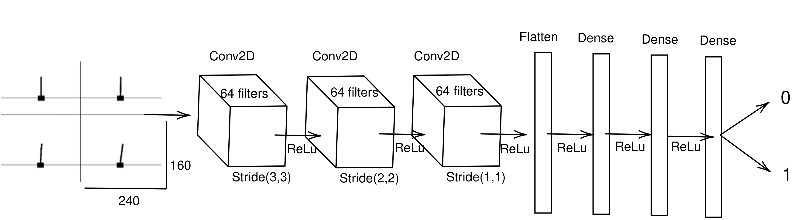
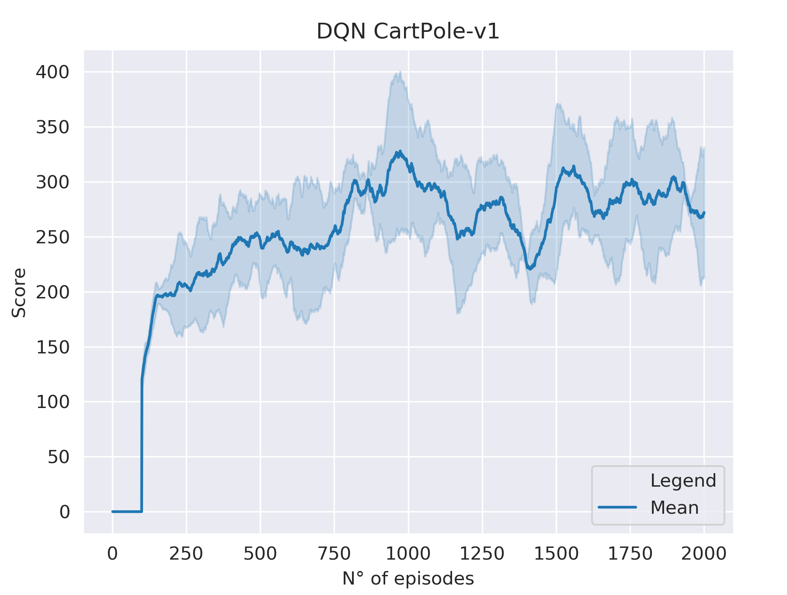
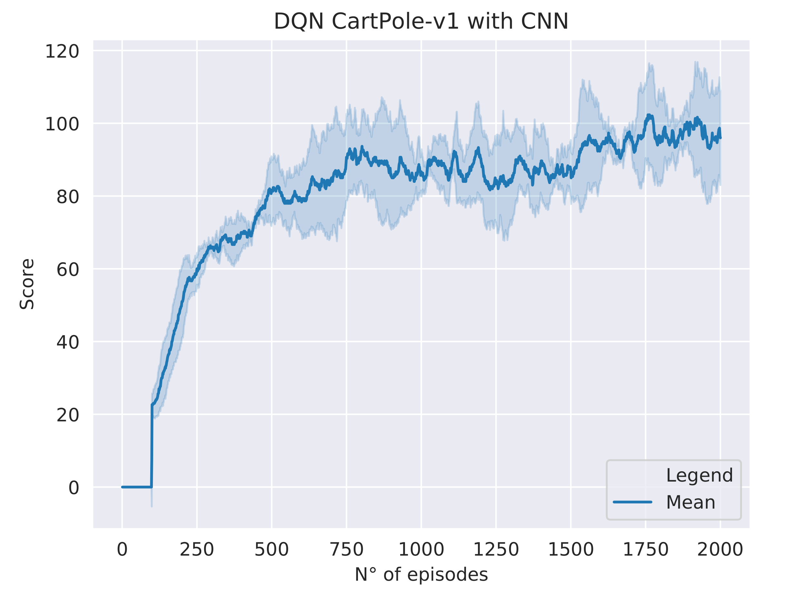

# CartPole-v1 with CNN using Keras

> Final project for the "fundamentals of Artificial Intelligence" course.
In this work the first task to solve was solving CartPole-v1 with the DQN algorithm.
The second task assigned was to solve CartPole-v1 using always the DQN algorithm but this time using Convolutional Neural Networks (CNN).

*Tensorflow*:   

*Keras*: 

*OpenAI Gym*: 

### Problem definition

A pole is attached by an un-actuated joint to a cart, which moves along a frictionless track. The system is controlled by applying a force of +1 or -1 to the cart. The pendulum starts upright, and the goal is to prevent it from falling over. A reward of +1 is provided for every timestep that the pole remains upright. The episode ends when the pole is more than 15 degrees from vertical, or the cart moves more than 2.4 units from the center.
CartPole-v1 defines "solving" as getting average reward of 195.0 over 100 consecutive trials.

## Model Architecture
Resolving CartPole using images involves using the $env.render(mode =$ 'rgb\_array'$)$ function to have a rendered frame image for each step of the episode.
Cartpole gym environment outputs 600x400 RGB arrays (600x400x3). That was way too many pixels with such simple task, more than I needed, so I converted the output to grayscale and I downsized it. The result was something like this:

**Architecture used:**

## Results

* CartPole-v1 trained with classic DNN using DQN without images:

As we can see from the plot starting from episode 150 more or less the CartPole-v1 is "solved" since it had an average reward of 195.0 or greater over 100 consecutive trials.

* CartPole-v1 trained with CNN usign DQN:

Making a comparison between the two plots, with the same number of episodes completed, we note that the use of images and in particular CNN to solve the task requires more time to consider the CartPole task solved. However, we can see how the average is constantly increasing, so I speculate that with other 2000 episodes the task can be solved also with CNN.

